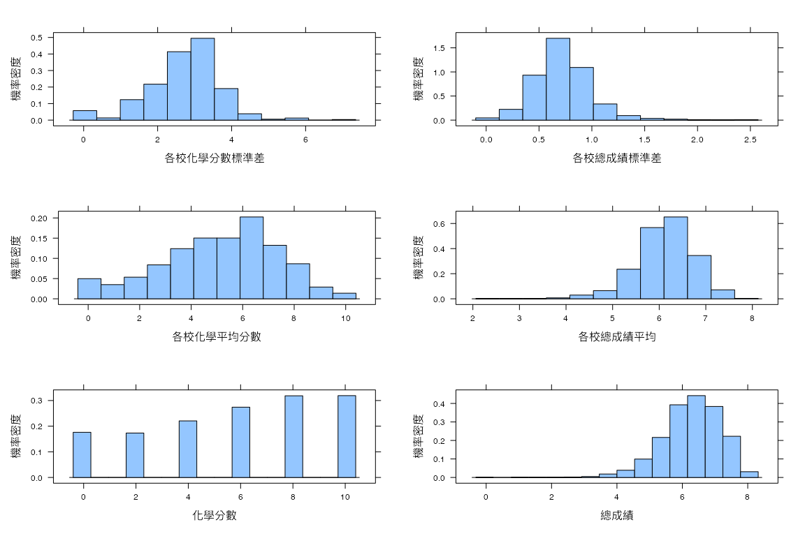
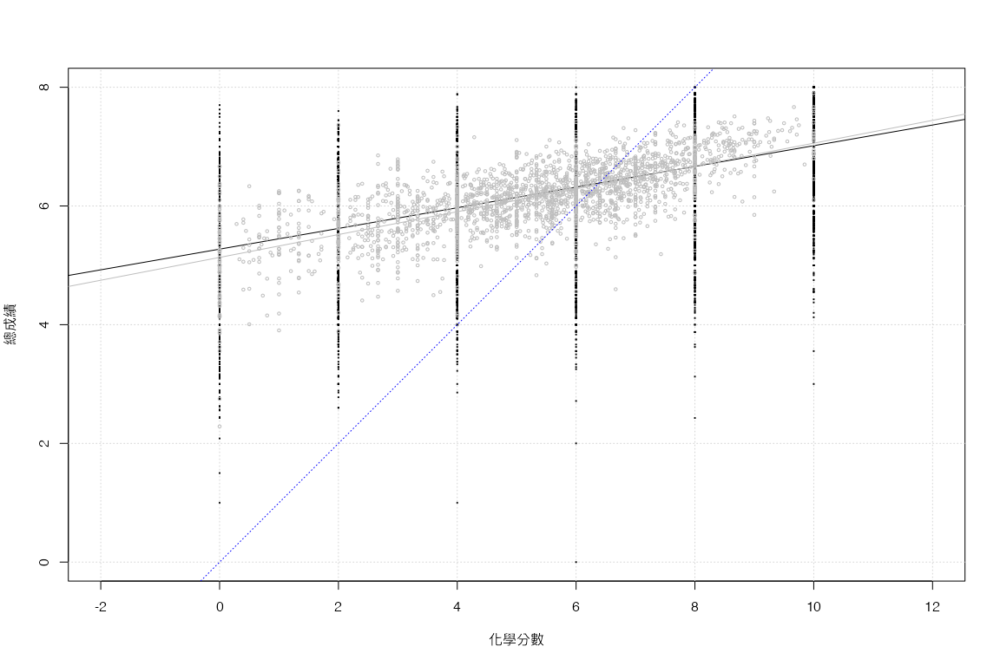
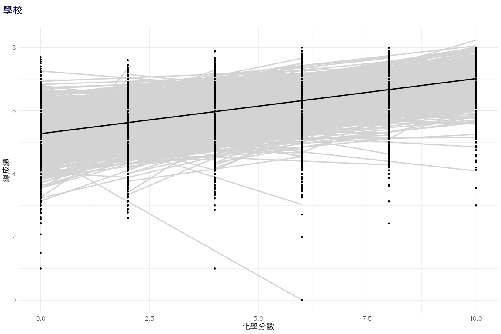
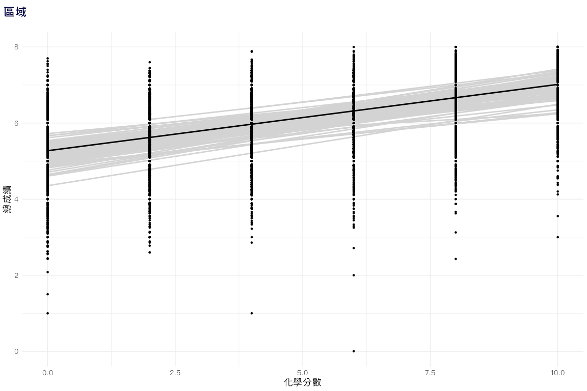
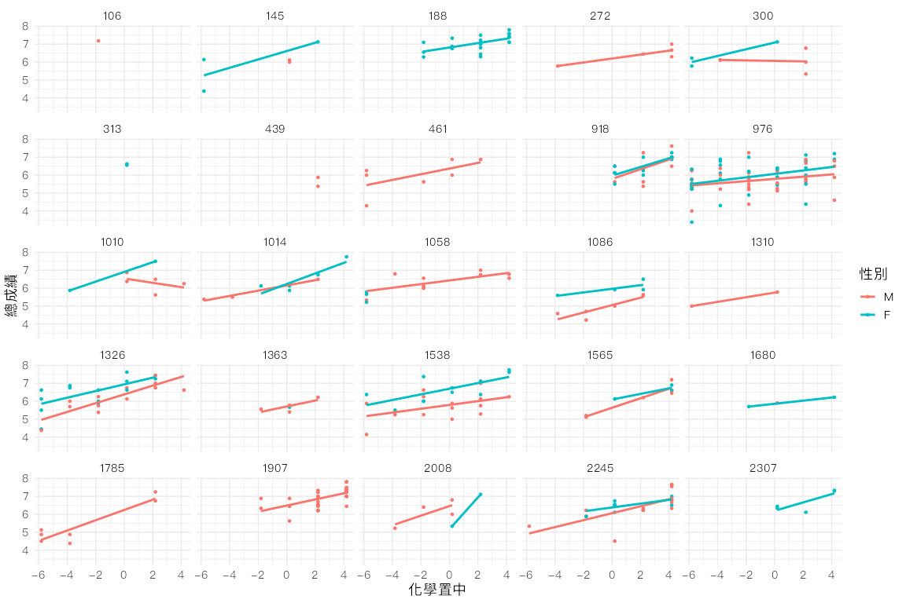
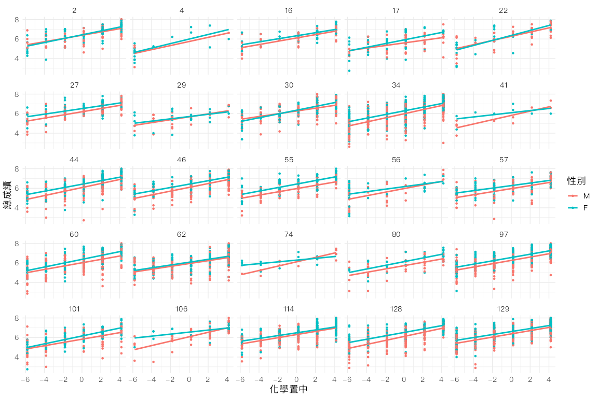
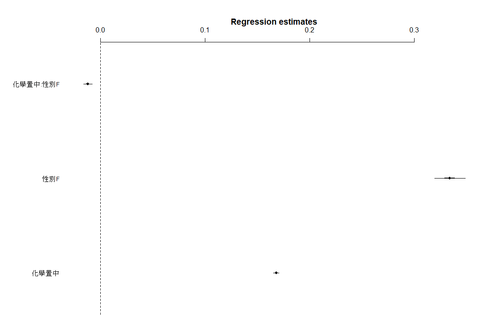
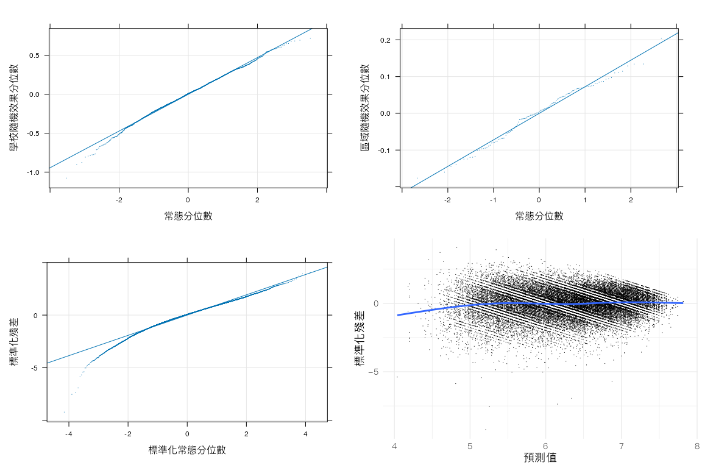

R在行為科學之應用:第五章
================
鄭中平、許清芳
2020 八月 26

``` r
if (!require("pacman")) install.packages("pacman")
pacman::p_load(mlmRev, gridExtra, tidyverse, coda, reshape,lme4)
```

### 資料管理

``` r
#載入mlmRev套件
library(mlmRev)
```

``` r
#載進資料 
data(Chem97)
```

``` r
#檢視套件提供的資訊
?Chem97
```

``` r
#看資料結構
str(Chem97)
```

    'data.frame':   31022 obs. of  8 variables:
     $ lea      : Factor w/ 131 levels "1","2","3","4",..: 1 1 1 1 1 1 1 1 1 1 ...
     $ school   : Factor w/ 2410 levels "1","2","3","4",..: 1 1 1 1 1 1 1 1 1 1 ...
     $ student  : Factor w/ 31022 levels "1","2","3","4",..: 1 2 3 4 5 6 7 8 9 10 ...
     $ score    : num  4 10 10 10 8 10 6 8 4 10 ...
     $ gender   : Factor w/ 2 levels "M","F": 2 2 2 2 2 2 2 2 2 2 ...
     $ age      : num  3 -3 -4 -2 -1 4 1 4 3 0 ...
     $ gcsescore: num  6.62 7.62 7.25 7.5 6.44 ...
     $ gcsecnt  : num  0.339 1.339 0.964 1.214 0.158 ...

``` r
#程式報表5.1
head(Chem97)
```

``` 
  lea school student score gender age gcsescore gcsecnt
1   1      1       1     4      F   3     6.625  0.3393
2   1      1       2    10      F  -3     7.625  1.3393
3   1      1       3    10      F  -4     7.250  0.9643
4   1      1       4    10      F  -2     7.500  1.2143
5   1      1       5     8      F  -1     6.444  0.1583
6   1      1       6    10      F   4     7.750  1.4643
```

``` r
#去掉第六與第八個變項，只將需要的資料留下，並重新命名
#原始文章分析是以 GCSE 預測 Chem，我們預計倒過來做
dta <- Chem97[, -c(6, 8)]
names(dta) <- c("區域", "學校", "學生", "化學", "性別", "總成績")
```

``` r
#程式報表5.1
head(dta)
```

``` 
  區域 學校 學生 化學 性別 總成績
1    1    1    1    4    F  6.625
2    1    1    2   10    F  7.625
3    1    1    3   10    F  7.250
4    1    1    4   10    F  7.500
5    1    1    5    8    F  6.444
6    1    1    6   10    F  7.750
```

### 描述統計

``` r
#程式報表5.2
sapply(dta[, c('化學', '總成績')], summary)
```

``` 
          化學 總成績
Min.     0.000  0.000
1st Qu.  4.000  5.750
Median   6.000  6.375
Mean     5.813  6.286
3rd Qu.  8.000  6.900
Max.    10.000  8.000
```

``` r
sapply(dta[, c('化學', '總成績')], sd)
```

``` 
  化學 總成績 
3.3192 0.8735 
```

``` r
#計算各校化學與總成績平均分數，記錄成資料檔，留待後用
dta_m <- aggregate(cbind(化學, 總成績, as.numeric(性別) - 1) ~ 學校, 
                   data = dta, mean)
names(dta_m) <- c('學校', '化學平均', '總成績平均', '女性比率')
```

``` r
#程式報表5.3
head(dta_m)
```

``` 
  學校 化學平均 總成績平均 女性比率
1    1    8.308      7.224   1.0000
2    2    8.714      7.024   0.0000
3    3    4.667      5.310   0.6667
4    4    8.286      6.232   0.1429
5    5    5.500      6.174   0.4375
6    6    4.714      6.705   0.7857
```

### 繪圖

``` r
#載進 lattice，準備畫圖
library(lattice)
```

``` r
#以總成績與化學原始分數，繪製直方圖
p1 <- histogram(~ 總成績, data = dta, type = 'density', 
                xlab = '總成績', ylab = '機率密度')
p2 <- histogram(~ 化學, data = dta, type = 'density', 
                xlab = '化學分數', ylab = '機率密度')
```

``` r
#以學校平均分數，繪製直方圖
p3 <- histogram(~ 總成績平均, data = dta_m, type = 'density', 
          xlab = '各校總成績平均', ylab = '機率密度')
p4 <- histogram(~ 化學平均, data = dta_m, type = 'density', 
          xlab = '各校化學平均分數', ylab = '機率密度')
```

``` r
#計算學校標準差，存檔留後用
dta_sd <- aggregate(cbind(化學, 總成績) ~ 學校, data = dta, sd)
names(dta_sd)[2:3] <- c('化學標準差', '總成績標準差')
```

``` r
#以學校標準差，繪製直方圖。
p5 <- histogram(~ 總成績標準差, data = dta_sd, type = 'density',
          xlab = '各校總成績標準差', ylab = '機率密度')
          
p6 <- histogram(~ 化學標準差, data = dta_sd, type = 'density',
          xlab = '各校化學分數標準差', ylab = '機率密度')
```

``` r
#載入gridExtra，把六張放一起
#圖 5.1
library(gridExtra)
grid.arrange(p6, p5, p4, p3, p2, p1, as.table = T)
```



``` r
#看看化學與總成績相關，以學生層次分數計算是 .662
cor(dta[, c('化學', '總成績')])
```

``` 
         化學 總成績
化學   1.0000 0.6622
總成績 0.6622 1.0000
```

``` r
#以學校層次分數計算生態相關（ecological correlation），為 .698
##程式報表5.4
cor(dta_m[, -1])
```

``` 
           化學平均 總成績平均 女性比率
化學平均    1.00000     0.6981  0.06625
總成績平均  0.69807     1.0000  0.24521
女性比率    0.06625     0.2452  1.00000
```

``` r
#畫看兩者間關聯
#圖5.2
plot(dta[, 4], dta[, 6], type = 'n', xlab ='化學分數', ylab = '總成績', 
     asp = 1)
grid()
#學生
points(dta[, 4], dta[, 6], pch = '.', cex = 2)
abline(lm(dta[,6] ~ dta[, 4]))
#學校
points(dta_m[, 2], dta_m[, 3], cex = 0.5, col = 'grey') 
abline(lm(dta_m[,3] ~ dta_m[,2]), col = 'grey')
#對角線
abline(0, 1, lty = 3, col = 'blue')
```



``` r
#看看各校與各區域以化學預測總分時的截距與斜率
#請注意原始文章的預測變項與解釋變項跟此所作是相反的。
#載入 ggplot2 套件，準備畫圖。
library(ggplot2)
```

``` r
# 記錄下原始配色
old <- theme_set(theme_bw())
```

``` r
#各校以化學預測總分時的截距與斜率
#圖5.3
ggplot(data = dta, aes(x = 化學, y = 總成績, group = 學校))+
 stat_smooth(method = 'lm', formula = y ~ x, se = F, color = 'lightgray') +
 geom_point(size = 1) +
 stat_smooth(aes(group = 1), method= 'lm', se = F, color = 'black') +
 labs(x = '化學分數', y = '總成績', title = '學校')
```



``` r
#各區域以化學預測總分時的截距與斜率
#圖5.4
ggplot(data = dta, aes(x = 化學, y = 總成績, group = 區域))+
 stat_smooth(method = 'lm', formula = y ~ x, se = F, color = 'lightgray') +
 geom_point(size = 1) +
 stat_smooth(aes(group = 1), method = 'lm', se = F, color = 'black') +
 labs(x = '化學分數', y = '總成績' , title = '區域') 
```



``` r
# 將變項以總分均置中，亦即，減去總平均。
dta$化學置中 <- scale(dta$化學, scale = F)
```

``` r
#選取25個學校與區域 
set.seed(1225)
ns25 <- sample(levels(dta$學校), 25)
set.seed(1225)
nr25 <- sample(levels(dta$區域), 25)
```

``` r
#重看一次各校以化學預測總分時的截距與斜率
#圖5.5
ggplot(data = dta[dta$學校 %in% ns25, ], aes(x = 化學置中, y = 總成績, color = 性別))+
  geom_point(size = 1) +
  stat_smooth(method = 'lm', formula = y ~ x, se = F) +
  facet_wrap( ~ 學校 )
```



``` r
#重看一次各區域以化學預測總分時的截距與斜率
#圖5.6
ggplot(data = dta[dta$區域 %in% nr25, ], aes(x = 化學置中, y = 總成績, color = 性別))+
  geom_point(size = 1) +
  stat_smooth(method = 'lm', formula = y ~ x, se = F) +
  facet_wrap( ~ 區域 )
```



### 多層次分析

``` r
#載入 lme4 套件，用來分析多層次資料
library(lme4)
```

``` r
# 將變項以總分均置中，亦即，減去總平均。
dta$化學置中 <- scale(dta$化學, scale = F)
```

``` r
#先以完整模型嘗試
#程式報表5.5
summary(m0 <- lmer(總成績 ~ 化學置中 + 性別 + 化學置中:性別 + 
                  ( 1 | 學校 ) + ( 1 | 區域 ), data = dta ) )       
```

    Linear mixed model fit by REML ['lmerMod']
    Formula: 總成績 ~ 化學置中 + 性別 + 化學置中:性別 + (1 | 學校) + (1 |  
        區域)
       Data: dta
    
    REML criterion at convergence: 55708
    
    Scaled residuals: 
       Min     1Q Median     3Q    Max 
    -9.231 -0.567  0.064  0.653  4.079 
    
    Random effects:
     Groups   Name        Variance Std.Dev.
     學校     (Intercept) 0.0876   0.296   
     區域     (Intercept) 0.0106   0.103   
     Residual             0.3181   0.564   
    Number of obs: 31022, groups:  學校, 2410; 區域, 131
    
    Fixed effects:
                   Estimate Std. Error t value
    (Intercept)     6.08025    0.01326  458.43
    化學置中        0.16808    0.00141  119.33
    性別F           0.33409    0.00752   44.44
    化學置中:性別F -0.01227    0.00209   -5.87
    
    Correlation of Fixed Effects:
                   (Intr) 化學置中 性別F 
    化學置中        0.051                
    性別F          -0.265 -0.065         
    化學置中:性別F -0.023 -0.630    0.067

``` r
# 試著去除區域的隨機效果，並看看去除隨機效果是否顯著。
m1 <- update(m0, . ~ . - ( 1 | 區域 ) )
```

``` r
#程式報表5.6
anova(m0, m1)
```

    Data: dta
    Models:
    m1: 總成績 ~ 化學置中 + 性別 + (1 | 學校) + 化學置中:性別
    m0: 總成績 ~ 化學置中 + 性別 + 化學置中:性別 + (1 | 學校) + (1 | 
    m0:     區域)
       npar   AIC   BIC logLik deviance Chisq Df Pr(>Chisq)
    m1    6 55743 55793 -27866    55731                    
    m0    7 55685 55744 -27836    55671  59.7  1    1.1e-14

``` r
#去除交互作用項
#程式報表5.7
drop1(m0, test = 'Chisq')
```

    Single term deletions
    
    Model:
    總成績 ~ 化學置中 + 性別 + 化學置中:性別 + (1 | 學校) + (1 | 
        區域)
                  npar   AIC  LRT Pr(Chi)
    <none>             55685             
    化學置中:性別    1 55718 34.4 4.5e-09

``` r
summary(m0)
```

    Linear mixed model fit by REML ['lmerMod']
    Formula: 總成績 ~ 化學置中 + 性別 + 化學置中:性別 + (1 | 學校) + (1 |  
        區域)
       Data: dta
    
    REML criterion at convergence: 55708
    
    Scaled residuals: 
       Min     1Q Median     3Q    Max 
    -9.231 -0.567  0.064  0.653  4.079 
    
    Random effects:
     Groups   Name        Variance Std.Dev.
     學校     (Intercept) 0.0876   0.296   
     區域     (Intercept) 0.0106   0.103   
     Residual             0.3181   0.564   
    Number of obs: 31022, groups:  學校, 2410; 區域, 131
    
    Fixed effects:
                   Estimate Std. Error t value
    (Intercept)     6.08025    0.01326  458.43
    化學置中        0.16808    0.00141  119.33
    性別F           0.33409    0.00752   44.44
    化學置中:性別F -0.01227    0.00209   -5.87
    
    Correlation of Fixed Effects:
                   (Intr) 化學置中 性別F 
    化學置中        0.051                
    性別F          -0.265 -0.065         
    化學置中:性別F -0.023 -0.630    0.067

### 固定效果

``` r
#載入 coefplot2 套件，繪製固定效果
if (!require("coefplot2")) install.packages("coefplot2",
    repos="http://www.math.mcmaster.ca/bolker/R")
library(coefplot2)
coefplot2(m0)
```



``` r
#抽取變異成分，計算學校與區域可以解釋部分（ICCs）
print(vc <- lme4::VarCorr(m0), comp = 'Variance' )
```

``` 
 Groups   Name        Variance
 學校     (Intercept) 0.0876  
 區域     (Intercept) 0.0106  
 Residual             0.3181  
```

``` r
vc <- as.data.frame(vc)
vc[vc$grp=='學校', 'vcov']/ sum(vc$vcov)
```

    [1] 0.2105

``` r
vc[vc$grp=='區域', 'vcov']/ sum(vc$vcov)
```

    [1] 0.02555

``` r
1 - (vc[vc$grp=='Residual', 'vcov']/ sum(vc$vcov))
```

    [1] 0.236

### 檢驗模型

``` r
#學校與區域層次的隨機效果QQ圖，檢查隨機效果是否呈常態
qq_r21 <- qqmath(~ ranef(m0)$學校, type = c('p', 'g', 'r'), pch = '.',
                xlab = '常態分位數', ylab = '學校隨機效果分位數')
```

``` r
qq_r22 <- qqmath(~ ranef(m0)$區域, type = c('p', 'g', 'r'), pch = '.',
                xlab = '常態分位數', ylab = '區域隨機效果分位數')
```

``` r
#殘差的QQ圖，檢驗殘差是否呈常態
qq_r0 <- qqmath(~ resid(m0, scale = T), type = c('p', 'g', 'r'), pch = '.',
                xlab = '標準化常態分位數', ylab = '標準化殘差')
```

``` r
#預測值對殘差圖
m0_f <-  data.frame(yhat=fitted(m0), zres=resid(m0, scaled=TRUE))
r_m0 <- ggplot(data = m0_f, aes(x = yhat, y = zres)) + 
          geom_point(pch = '.') +
          stat_smooth(method = 'gam', formula = y ~ s(x, bs='cs'),
                      se = FALSE) +
          labs( x = '預測值', y = '標準化殘差')
```

``` r
#把圖放在一起呈現
#圖5.7
library(gridExtra)
grid.arrange(qq_r21, qq_r22, qq_r0, r_m0, nrow = 2, ncol = 2)
```



### 複雜的多層次模型

``` r
#顯示複雜的多層次模型，包括隨機斜率效果、學校層次的預測變項以及跨層次交互作用
#先要將不同層次資料併在一起
dta <- merge(dta, dta_m, by="學校") 
```

``` r
rslt <- lmer(總成績 ~ 化學置中 + 性別 + 化學置中:性別 +
        女性比率 + 女性比率:性別+
        (1+化學置中+性別|學校) + (1|區域), data=dta)
summary(rslt)
```

    Linear mixed model fit by REML ['lmerMod']
    Formula: 總成績 ~ 化學置中 + 性別 + 化學置中:性別 + 女性比率 + 女性比率:性別 +  
        (1 + 化學置中 + 性別 | 學校) + (1 | 區域)
       Data: dta
    
    REML criterion at convergence: 55393
    
    Scaled residuals: 
       Min     1Q Median     3Q    Max 
    -9.347 -0.561  0.068  0.650  4.123 
    
    Random effects:
     Groups   Name        Variance Std.Dev. Corr       
     學校     (Intercept) 0.098252 0.3135              
              化學置中    0.000548 0.0234   -0.56      
              性別F       0.018382 0.1356   -0.63  0.06
     區域     (Intercept) 0.010583 0.1029              
     Residual             0.310352 0.5571              
    Number of obs: 31022, groups:  學校, 2410; 區域, 131
    
    Fixed effects:
                   Estimate Std. Error t value
    (Intercept)     6.14024    0.01925  318.96
    化學置中        0.16985    0.00156  109.10
    性別F           0.14634    0.02227    6.57
    女性比率       -0.22291    0.04005   -5.57
    化學置中:性別F -0.01108    0.00216   -5.14
    性別F:女性比率  0.43090    0.04827    8.93
    
    Correlation of Fixed Effects:
                   (Intr) 化學置中 性別F  女性比率 化中:性別F
    化學置中       -0.094                                    
    性別F          -0.483 -0.004                             
    女性比率       -0.705  0.069    0.645                    
    化學置中:性別F  0.065 -0.609    0.004 -0.101             
    性別F:女性比率  0.495 -0.026   -0.915 -0.797    0.029    
    convergence code: 0
    Model failed to converge with max|grad| = 0.0745118 (tol = 0.002, component 1)

### 結束

顯示演練單元信息

``` r
sessionInfo()
```

``` 
R version 4.0.2 (2020-06-22)
Platform: x86_64-w64-mingw32/x64 (64-bit)
Running under: Windows 10 x64 (build 18363)

Matrix products: default

locale:
[1] LC_COLLATE=Chinese (Traditional)_Taiwan.950 
[2] LC_CTYPE=Chinese (Traditional)_Taiwan.950   
[3] LC_MONETARY=Chinese (Traditional)_Taiwan.950
[4] LC_NUMERIC=C                                
[5] LC_TIME=Chinese (Traditional)_Taiwan.950    

attached base packages:
[1] stats     graphics  grDevices utils     datasets  methods   base     

other attached packages:
 [1] coefplot2_0.1.3.2 lattice_0.20-41   reshape_0.8.8     coda_0.19-3      
 [5] forcats_0.5.0     stringr_1.4.0     dplyr_1.0.0       purrr_0.3.4      
 [9] readr_1.3.1       tidyr_1.1.0       tibble_3.0.3      ggplot2_3.3.2    
[13] tidyverse_1.3.0   gridExtra_2.3     mlmRev_1.0-8      lme4_1.1-23      
[17] Matrix_1.2-18     pacman_0.5.1     

loaded via a namespace (and not attached):
 [1] Rcpp_1.0.4.6     lubridate_1.7.9  assertthat_0.2.1 digest_0.6.25   
 [5] plyr_1.8.6       R6_2.4.1         cellranger_1.1.0 backports_1.1.6 
 [9] reprex_0.3.0     evaluate_0.14    httr_1.4.1       pillar_1.4.3    
[13] rlang_0.4.7      readxl_1.3.1     minqa_1.2.4      rstudioapi_0.11 
[17] nloptr_1.2.2.1   blob_1.2.1       rmarkdown_2.3    labeling_0.3    
[21] splines_4.0.2    statmod_1.4.34   munsell_0.5.0    broom_0.7.0     
[25] compiler_4.0.2   modelr_0.1.8     xfun_0.15        pkgconfig_2.0.3 
[29] mgcv_1.8-31      htmltools_0.5.0  tidyselect_1.1.0 fansi_0.4.1     
[33] withr_2.2.0      crayon_1.3.4     dbplyr_1.4.4     MASS_7.3-51.6   
[37] grid_4.0.2       nlme_3.1-148     jsonlite_1.7.0   gtable_0.3.0    
[41] lifecycle_0.2.0  DBI_1.1.0        magrittr_1.5     scales_1.1.1    
[45] cli_2.0.2        stringi_1.4.6    farver_2.0.3     fs_1.4.1        
[49] xml2_1.3.2       ellipsis_0.3.0   generics_0.0.2   vctrs_0.3.1     
[53] boot_1.3-25      tools_4.0.2      glue_1.4.0       hms_0.5.3       
[57] yaml_2.2.1       colorspace_1.4-1 rvest_0.3.5      knitr_1.29      
[61] haven_2.3.1     
```
